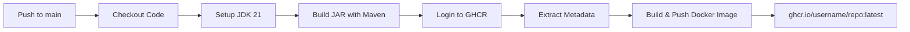
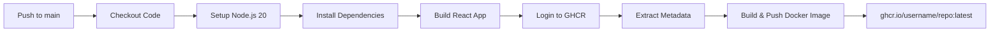
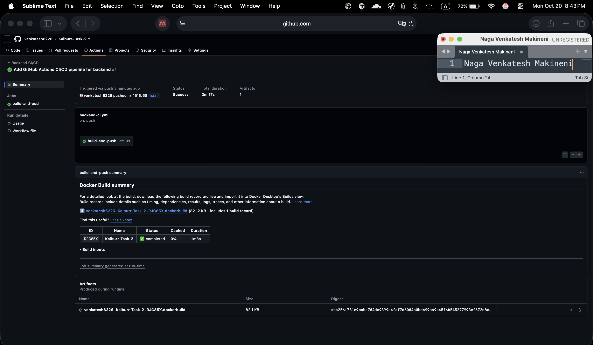
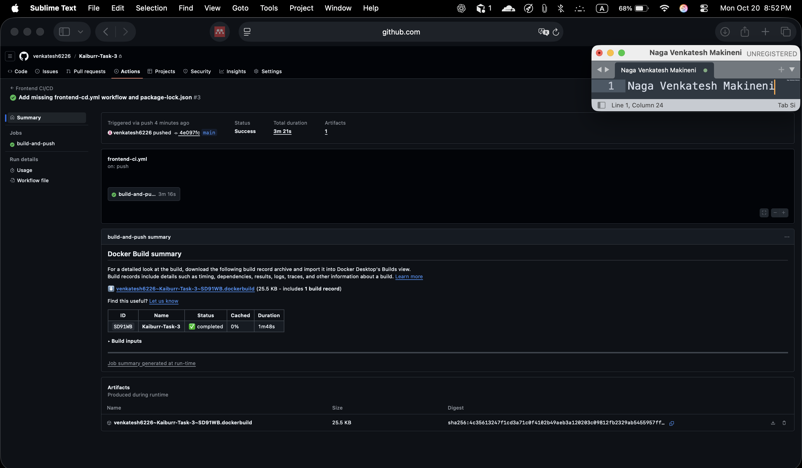

# Task 4: CI/CD Pipeline Documentation

## 🚀 Overview

This document explains the CI/CD pipelines implemented for both the backend (Task 2) and frontend (Task 3) using GitHub Actions and GitHub Container Registry (GHCR).

## 📁 Repository Structure

```
kaiburr/
├── task-2/                    # Backend (Spring Boot + MongoDB)
│   ├── .github/workflows/
│   │   └── backend-ci.yml     # Backend CI/CD pipeline
│   ├── Dockerfile             # Spring Boot containerization
│   └── pom.xml               # Maven build configuration
├── task-3/                    # Frontend (React + TypeScript)
│   ├── .github/workflows/
│   │   └── frontend-ci.yml    # Frontend CI/CD pipeline
│   ├── Dockerfile             # React + Nginx containerization
│   └── package.json          # Node.js build configuration
└── task-4/                    # This documentation
    └── README.md              # This file
```

## 🔄 Pipeline Flow

### Backend Pipeline (`task-2/.github/workflows/backend-ci.yml`)



**Steps:**

1. **Trigger**: Push to `main` branch
2. **Build**: `mvn -q -B -DskipTests package`
3. **Containerize**: Multi-stage Docker build
4. **Push**: Image to `ghcr.io/${{ github.repository }}:latest`

### Frontend Pipeline (`task-3/.github/workflows/frontend-ci.yml`)



**Steps:**

1. **Trigger**: Push to `main` branch
2. **Build**: `npm ci && npm run build`
3. **Containerize**: Multi-stage Docker build (Node.js + Nginx)
4. **Push**: Image to `ghcr.io/${{ github.repository }}:latest`

## 🛠️ Setup Instructions

### Prerequisites

- GitHub repository with Actions enabled
- Docker Hub or GitHub Container Registry access
- Local development environment

### Required Secrets

No additional secrets needed! The pipelines use:

- `GITHUB_TOKEN`: Automatically provided by GitHub Actions
- `github.actor`: Automatically provided (your username)

### Local Testing

**Backend:**

```bash
cd task-2
mvn -q -B -DskipTests package
docker build -t shell-runner-backend:local .
docker run -p 8080:8080 shell-runner-backend:local
```

**Frontend:**

```bash
cd task-3
npm ci
npm run build
docker build -t shell-runner-frontend:local .
docker run -p 3000:80 shell-runner-frontend:local
```

## 📊 Pipeline Features

### ✅ What's Included

- **Automated Builds**: Triggered on every push to `main`
- **Dependency Caching**: Maven and npm caches for faster builds
- **Multi-stage Docker**: Optimized image sizes
- **Metadata Extraction**: Automatic tagging with commit SHA and latest
- **GHCR Integration**: Seamless push to GitHub Container Registry
- **Cross-platform**: Runs on Ubuntu latest runners

### 🔧 Configuration

**Backend (`backend-ci.yml`):**

- Java Version: 21 (Temurin distribution)
- Build Command: `mvn -q -B -DskipTests package`
- Port: 8080
- Registry: `ghcr.io/${{ github.repository }}`

**Frontend (`frontend-ci.yml`):**

- Node Version: 20
- Build Command: `npm ci && npm run build`
- Port: 80 (Nginx)
- Registry: `ghcr.io/${{ github.repository }}`

## 📸 Screenshots

### Backend CI/CD Pipeline


_Backend CI/CD workflow showing successful Maven build and Docker image push to GHCR_

### Frontend CI/CD Pipeline


_Frontend CI/CD workflow showing successful npm build and Docker image push to GHCR_

### GitHub Container Registry


_GitHub Container Registry showing both backend and frontend Docker images with latest tags_

## 🚀 Usage

### Triggering Builds

1. **Automatic**: Push code to `main` branch
2. **Manual**: Go to Actions tab → Select workflow → Run workflow

### Viewing Results

1. Go to your repository's **Actions** tab
2. Click on the latest workflow run
3. View logs for each step
4. Check **Packages** tab for pushed images

### Pulling Images

```bash
# Pull latest backend image
docker pull ghcr.io/yourusername/yourrepo:latest

# Pull latest frontend image
docker pull ghcr.io/yourusername/yourrepo:latest
```

## 🔍 Troubleshooting

### Common Issues

**Build Failures:**

- Check Maven/Node.js versions match local development
- Verify `pom.xml`/`package.json` dependencies
- Review build logs in Actions tab

**Docker Push Failures:**

- Ensure repository has `packages: write` permission
- Check if GHCR is enabled for your account
- Verify `GITHUB_TOKEN` has correct scopes

**Image Pull Issues:**

- Make sure images are public or you're authenticated
- Check image tags match what you're pulling
- Verify registry URL is correct

### Debug Commands

```bash
# Check local Docker images
docker images | grep ghcr.io

# Test image locally
docker run -it --rm ghcr.io/yourusername/yourrepo:latest

# Check image layers
docker history ghcr.io/yourusername/yourrepo:latest
```

## 📈 Next Steps

### Potential Enhancements

1. **Testing**: Add unit/integration tests to CI
2. **Security**: Add vulnerability scanning with Trivy
3. **Deployment**: Add Kubernetes deployment steps
4. **Notifications**: Add Slack/email notifications
5. **Environments**: Add staging/production environments
6. **Rollbacks**: Implement automated rollback capabilities

### Advanced Features

- **Matrix Builds**: Test multiple Node.js/Java versions
- **Parallel Jobs**: Run tests and builds in parallel
- **Artifact Storage**: Store build artifacts for debugging
- **Environment Variables**: Use GitHub Environments for secrets
- **Approval Gates**: Require manual approval for production

## 📚 Resources

- [GitHub Actions Documentation](https://docs.github.com/en/actions)
- [GitHub Container Registry](https://docs.github.com/en/packages/working-with-a-github-packages-registry/working-with-the-container-registry)
- [Docker Multi-stage Builds](https://docs.docker.com/develop/dev-best-practices/dockerfile_best-practices/)
- [Maven Build Lifecycle](https://maven.apache.org/guides/introduction/introduction-to-the-lifecycle.html)
- [npm ci vs npm install](https://docs.npmjs.com/cli/v8/commands/npm-ci)

---

**Created by**: DevOps CI/CD Pipeline Implementation  
**Date**: 2024  
**Tools**: GitHub Actions, Docker, GHCR, Maven, npm
